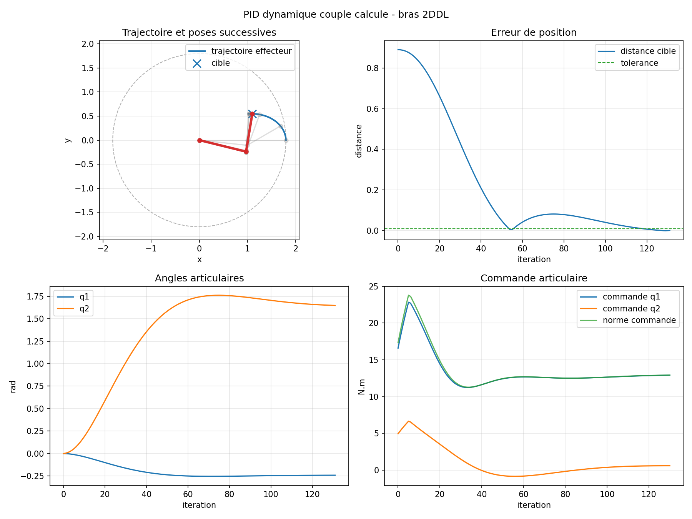
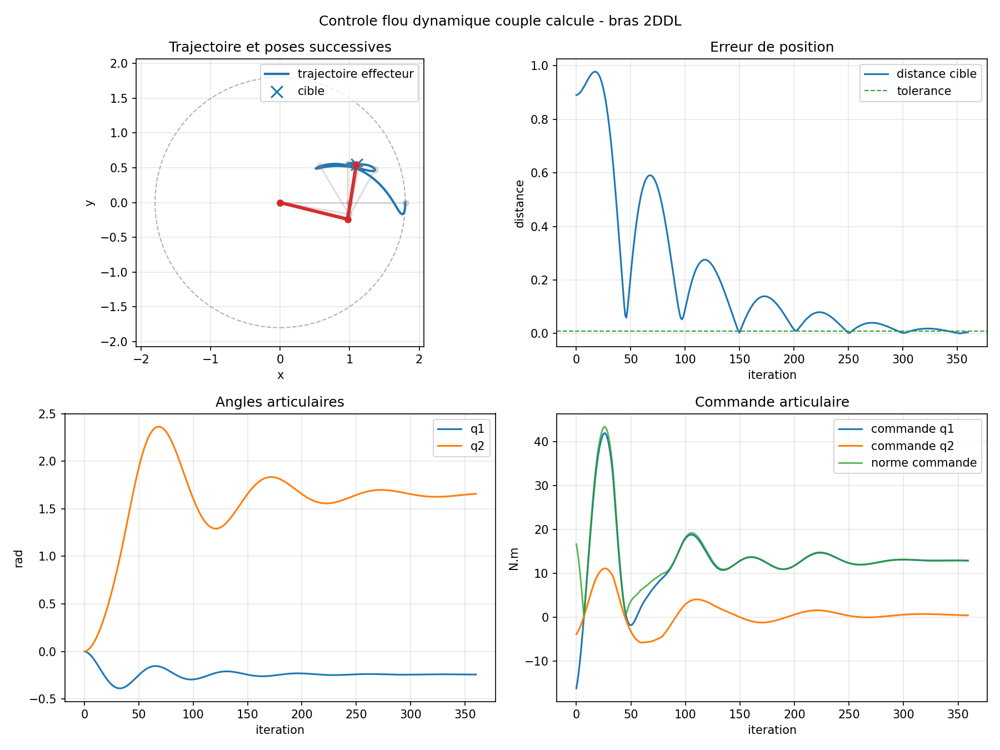
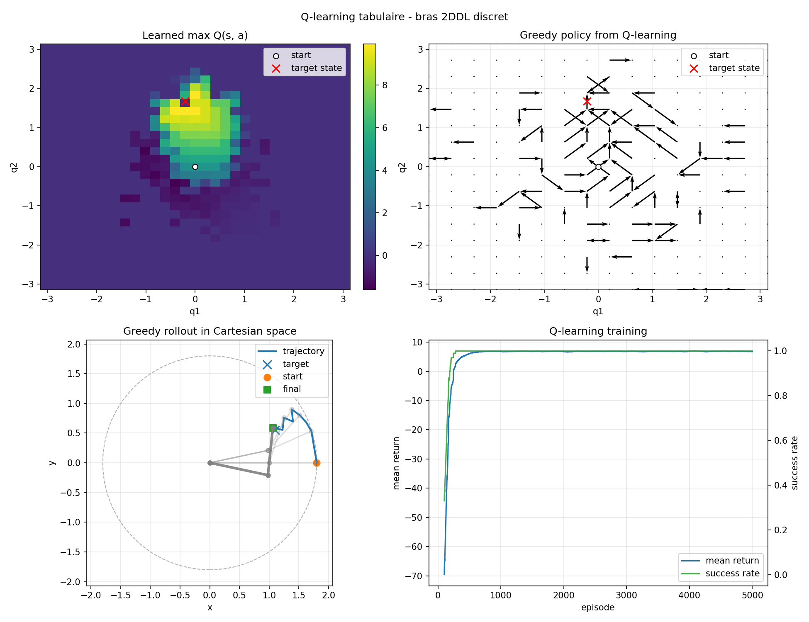
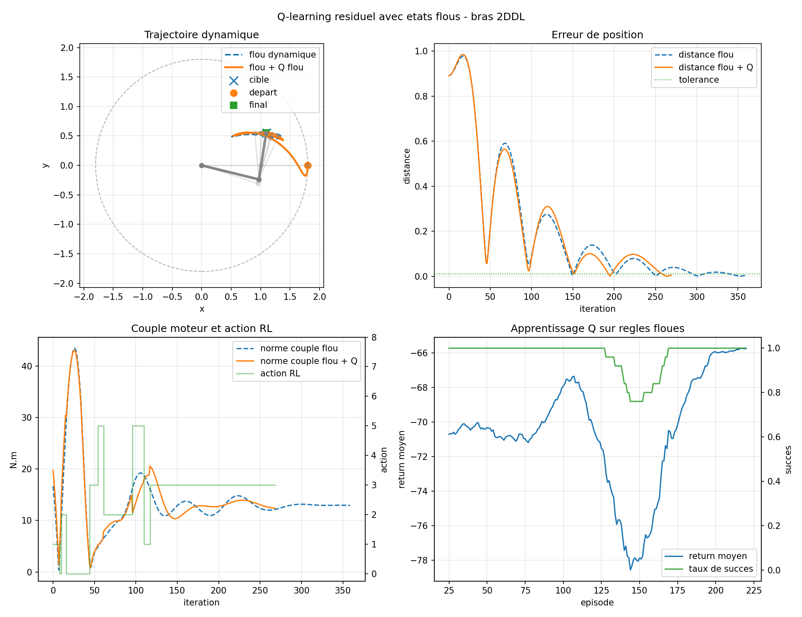
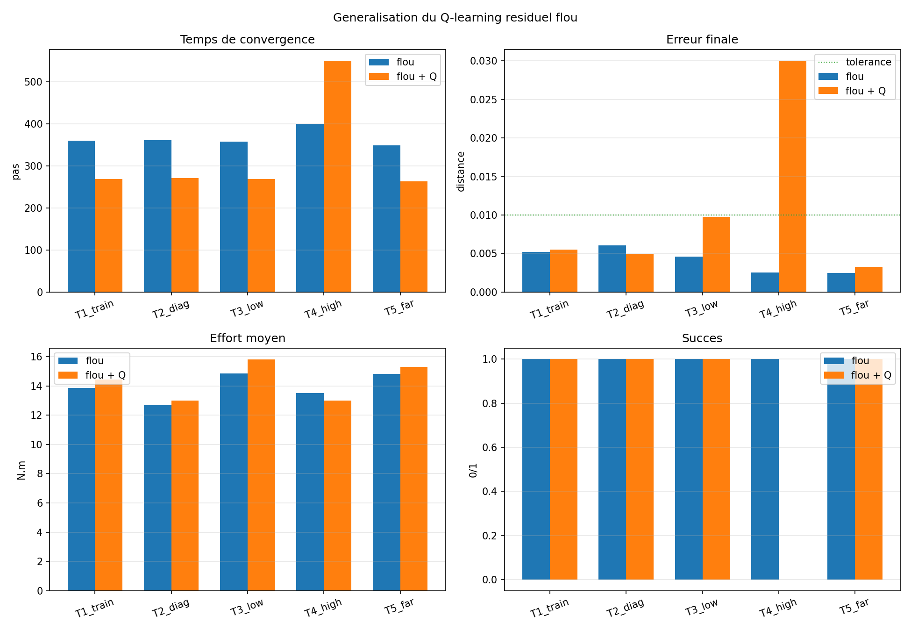
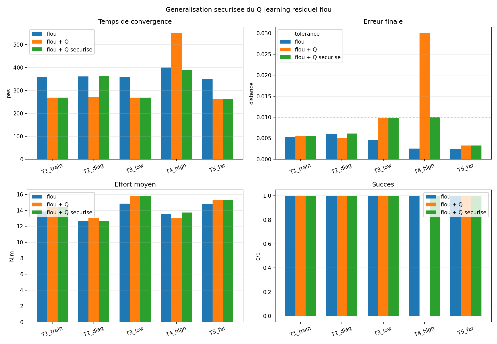

# Rapport court - Commande floue et apprentissage par renforcement pour un bras robotique 2 DDL

## 1. Objet du travail

Le cahier des charges vise a demontrer progressivement, par simulation, que
l'apprentissage par renforcement peut etre applique a la commande de bras
robotiques. La demarche retenue est volontairement progressive : partir d'un
bras planaire a `2 DDL`, valider les modeles et les commandes en Python, puis
transposer ensuite vers CoppeliaSim et vers des bras plus complexes `3 DDL` puis
`6 DDL`.

L'hypothese scientifique defendue ici est la suivante : une architecture
hybride combinant logique floue et apprentissage par renforcement est plus
appropriee qu'un RL pur au debut du projet, car elle associe :

- une commande floue stable et interpretable ;
- une structuration linguistique de l'etat continu ;
- une capacite d'adaptation par apprentissage via le RL ;
- un mecanisme de securite qui permet de revenir au controleur flou si le
  residu appris degrade le comportement.

Le projet a deja implemente la cinematique, la dynamique, un PID, un controleur
flou, un Q-learning discret, un Q-learning residuel dynamique, puis une
architecture flou/RL securisee. Une interface Python live a egalement ete ajoutee
pour manipuler la cible, les perturbations et les controleurs en direct.

## 2. Rappel court : logique floue

La logique floue permet de commander un systeme a partir de notions
linguistiques proches du raisonnement humain, par exemple :

```text
erreur negative, erreur nulle, erreur positive
vitesse lente, vitesse moyenne, vitesse rapide
commande faible, commande moyenne, commande forte
```

Contrairement a une logique binaire, une variable peut appartenir partiellement
a plusieurs ensembles. Pour une variable normalisee `x`, on utilise ici trois
ensembles :

```text
mu_negative(x), mu_zero(x), mu_positive(x)
```

Une regle floue prend la forme :

```text
SI erreur est positive ET variation_erreur est positive
ALORS commande est positive forte
```

Dans notre cas, le controleur flou calcule une acceleration articulaire
commandee. Pour chaque articulation :

```text
e = q_desire - q
de/dt ~= (e(t) - e(t-dt)) / dt
q_ddot_flou = defuzzification(regles(e, de/dt))
```

L'interet de cette approche est double. D'abord, elle est lisible : les regles
peuvent etre expliquees. Ensuite, elle produit une politique de base stable qui
peut atteindre la cible sans apprentissage lourd.

## 3. Rappel court : apprentissage par renforcement

L'apprentissage par renforcement modelise le probleme comme un processus de
decision de Markov :

```text
MDP = (S, A, P, R, gamma)
```

avec :

- `S` : ensemble des etats ;
- `A` : ensemble des actions ;
- `P(s'|s,a)` : transition ;
- `R(s,a,s')` : recompense ;
- `gamma` : facteur d'actualisation.

Une politique choisit une action a partir d'un etat :

```text
pi(s) = a
```

Le retour actualise d'une trajectoire est :

```text
G = r0 + gamma r1 + gamma^2 r2 + ... + gamma^T rT
```

La valeur d'etat est :

```text
V_pi(s) = E_pi[G | S0 = s]
```

La valeur action-etat est :

```text
Q_pi(s,a) = E_pi[G | S0 = s, A0 = a]
```

L'equation d'optimalite de Bellman est :

```text
V*(s) = max_a sum_s' P(s'|s,a) [R(s,a,s') + gamma V*(s')]
```

En Q-learning tabulaire, la mise a jour devient :

```text
Q(s,a) <- Q(s,a) + alpha [r + gamma max_a' Q(s',a') - Q(s,a)]
```

Dans notre projet, le RL est d'abord introduit sur un MDP discret pour rendre
visibles les notions d'etat, action, reward, return, politique, valeur et
Bellman. Ensuite, il est transfere vers la dynamique sous forme residuelle : le
RL n'apprend pas toute la commande, il apprend une correction autour d'un
controleur stabilisant.

## 4. Modele mathematique du bras 2 DDL

Le bras est planaire, compose de deux segments de longueurs `l1` et `l2`, avec
deux angles articulaires :

```text
q = [q1, q2]^T
```

La cinematique directe est :

```text
x = l1 cos(q1) + l2 cos(q1 + q2)
y = l1 sin(q1) + l2 sin(q1 + q2)
```

La Jacobienne relie les vitesses articulaires a la vitesse de l'effecteur :

```text
[x_dot]   [ -l1 sin(q1) - l2 sin(q1+q2)   -l2 sin(q1+q2) ] [q1_dot]
[y_dot] = [  l1 cos(q1) + l2 cos(q1+q2)    l2 cos(q1+q2) ] [q2_dot]
```

Le modele dynamique utilise pour les simulations a couples est :

```text
M(q) q_ddot + C(q,q_dot) q_dot + G(q) + F q_dot = tau
```

ou :

- `M(q)` est la matrice d'inertie ;
- `C(q,q_dot) q_dot` regroupe les termes de Coriolis et centrifuges ;
- `G(q)` represente la gravite ;
- `F q_dot` represente le frottement visqueux ;
- `tau = [tau1, tau2]^T` est le couple moteur.

La commande a couple calcule utilise l'inverse dynamique :

```text
tau = M(q) q_ddot_cmd + C(q,q_dot)q_dot + G(q) + F q_dot
```

Ainsi, un controleur peut calculer `q_ddot_cmd`, puis le simulateur convertit
cette acceleration desiree en couple moteur.

## 5. Methode proposee : architecture flou/RL residuelle

L'architecture retenue pour l'hybridation est :

```text
q_ddot_cmd = q_ddot_flou + q_ddot_RL_residuel
tau = M(q) q_ddot_cmd + C(q,q_dot)q_dot + G(q) + F q_dot
```

La logique floue joue deux roles :

- elle fournit la commande de base `q_ddot_flou` ;
- elle structure l'etat continu pour le RL.

L'etat dynamique utilise par le RL est :

```text
x = (erreur_q1, erreur_q2, q1_dot, q2_dot)
```

Chaque variable est projetee sur trois termes :

```text
negative, zero, positive
```

On obtient donc :

```text
3^4 = 81 regles floues
```

Chaque observation active plusieurs regles avec des poids `w_i(x)`. La valeur
d'une action est alors agregee :

```text
Q_flou(x,a) = somme_i w_i(x) Q(regle_i, a)
```

La mise a jour Q-learning distribue l'erreur temporelle sur les regles actives :

```text
delta = r + gamma max_a' Q_flou(x',a') - Q_flou(x,a)
Q(regle_i,a) <- Q(regle_i,a) + alpha w_i(x) delta
```

Le reward combine les objectifs de commande :

```text
r = -wd distance - wv ||q_dot|| - wt ||tau|| - wr ||q_ddot_RL||
    + wp (distance_precedente - distance) + bonus_succes
```

Cette formulation est prudente et defendable : le RL n'est pas force
d'apprendre une commande complete depuis zero ; il apprend quand ajouter une
correction utile a une politique floue deja stable.

## 6. Resultats principaux

### 6.1 Commande dynamique PID et floue

Le PID dynamique atteint la cible en `131` pas avec une distance finale de
`1.38e-03` et un couple moyen de `13.66 N.m`. Le controleur flou dynamique
atteint la meme cible en `360` pas avec une distance finale de `5.23e-03` et un
couple moyen de `13.85 N.m`.

Ces resultats montrent que la base dynamique est validee et que le controleur
flou converge, meme s'il est plus lent que le PID sur ce reglage initial.





### 6.2 Q-learning discret

Le Q-learning tabulaire retrouve une trajectoire efficace dans le MDP discret :
la politique apprise atteint la cible en `8` actions, comme la politique
optimale obtenue par value iteration. La valeur apprise au depart est tres
proche de la valeur optimale (`4.4075` contre `4.4161`).



### 6.3 Flou/RL sur cible de reference

Sur la cible `(1.10, 0.55)`, la combinaison flou/RL donne :

```text
flou seul          : 360 pas, distance finale 0.005227, couple moyen 13.853
flou + Q residuel  : 269 pas, distance finale 0.005537, couple moyen 14.420
```

Le RL accelere donc la convergence de `91` pas, avec une precision comparable.
Le prix a payer est une augmentation moderee de l'effort moteur.



### 6.4 Generalisation multi-cibles

Une table Q apprise sur la cible de reference a ete testee sans reentrainement
sur cinq cibles. Le flou seul reussit `5/5`. Le flou/RL brut reussit `4/5` :
il accelere quatre cibles, mais echoue sur `T4_high`.

```text
flou seul     : succes 5/5
flou + Q brut : succes 4/5
gain moyen    : -41.2 pas
surcout moyen : +0.36 N.m
```

Ce resultat est important scientifiquement : il montre a la fois le potentiel
du residu appris et sa limite de robustesse lorsqu'il est applique sans garde.



### 6.5 Supervision de securite

Pour eviter qu'un residu RL degrade la politique floue, un superviseur a ete
ajoute :

```text
si la distance ne progresse plus pendant 100 pas :
    q_ddot_RL_residuel = 0
    q_ddot_cmd = q_ddot_flou
```

Le resultat devient :

```text
flou seul             : succes 5/5
flou + Q brut         : succes 4/5
flou + Q securise     : succes 5/5
gain moyen securise   : -55 pas
surcout moyen securise: +0.46 N.m
```

La version securisee restaure la convergence sur toutes les cibles, tout en
gardant un gain de vitesse moyen par rapport au flou seul.



## 7. Etat actuel du projet

Le projet dispose actuellement de :

- un modele cinematique et dynamique complet du bras 2 DDL ;
- un environnement Python avec etat, cible, reward, limites et couples ;
- des commandes PID et floues ;
- une formulation RL avec Bellman et Q-learning discret ;
- un Q-learning residuel dynamique ;
- une architecture flou/RL securisee ;
- des tests unitaires automatiques ;
- des figures PNG et tableaux de comparaison ;
- une simulation Python live interactive.

La simulation live permet de changer la cible, basculer entre les controleurs,
appliquer une perturbation et observer la reponse en direct. C'est une etape
necessaire avant CoppeliaSim, car elle valide l'interactivite et le protocole de
comparaison sans alourdir encore l'environnement.

## 8. Argument en faveur de la methode flou/RL

Le RL pur est attractif, mais il devient rapidement couteux et instable lorsque
l'espace d'etat-action grandit. Pour un bras robotique, apprendre directement
les couples moteurs depuis zero peut demander beaucoup d'episodes et produire
des mouvements non fiables au debut.

La methode flou/RL contourne ce probleme :

- la logique floue fournit une politique initiale interpretable ;
- le RL apprend seulement un residu, donc l'espace d'apprentissage est reduit ;
- les regles floues structurent l'etat et favorisent une generalisation locale ;
- le superviseur garantit un retour au controleur flou si le residu devient
  defavorable ;
- l'approche reste compatible avec la dynamique et donc avec CoppeliaSim.

Le resultat actuel ne doit pas etre presente comme une superiorite definitive.
Il montre plutot une contribution methodologique solide : le RL peut ameliorer
une commande floue sur la vitesse de convergence, tandis que la logique floue
maintient l'interpretabilite et la robustesse.

## 9. Limites et prochaines etapes

Les limites actuelles sont claires :

- entrainement encore centre sur une cible de reference ;
- Q-learning tabulaire, donc peu scalable vers `6 DDL` sans adaptation ;
- superviseur encore heuristique ;
- absence de validation CoppeliaSim pour l'instant ;
- comparaison energie/vitesse encore a affiner.

Les prochaines etapes recommandees sont :

1. entrainer le flou/RL sur une distribution de cibles ;
2. ajuster le reward pour mieux controler l'effort et la douceur ;
3. remplacer la coupure heuristique par une estimation de confiance ;
4. connecter la meme boucle de controle a CoppeliaSim ;
5. etendre progressivement vers `3 DDL`, puis `6 DDL`.

## 10. Conclusion

Le travail effectue valide une strategie progressive et scientifiquement
defendable. Le PID donne une reference classique, la logique floue donne une
commande interpretable et stable, puis le RL apporte une capacite
d'amelioration par interaction. L'hybridation flou/RL securisee est donc la
methode a privilegier pour la suite : elle est plus prudente qu'un RL pur, plus
adaptative qu'un controleur flou fixe, et directement compatible avec le
passage futur vers CoppeliaSim.

Le choix recommande est donc de poursuivre avec l'architecture :

```text
controleur flou stabilisant
+ etat structure par regles floues
+ Q-learning residuel
+ supervision de securite
```

Cette architecture constitue une base claire pour convaincre, tester et
generaliser l'apprentissage par renforcement applique a la commande de bras
robotiques.

## Figures PNG disponibles

Les figures suivantes ont ete produites par le projet :

- `results/figures/step_01_kinematics_2dof.png`
- `results/figures/step_02_pid_2dof.png`
- `results/figures/step_03_fuzzy_2dof.png`
- `results/figures/step_04_rl_bellman_2dof.png`
- `results/figures/step_06_pid_dynamic_2dof.png`
- `results/figures/step_07_fuzzy_dynamic_2dof.png`
- `results/figures/step_08_q_learning_2dof.png`
- `results/figures/step_09_dynamic_residual_q_learning_2dof.png`
- `results/figures/step_10_fuzzy_residual_q_learning_2dof.png`
- `results/figures/step_11_fuzzy_residual_generalization_2dof.png`
- `results/figures/step_12_fuzzy_residual_safe_generalization_2dof.png`
